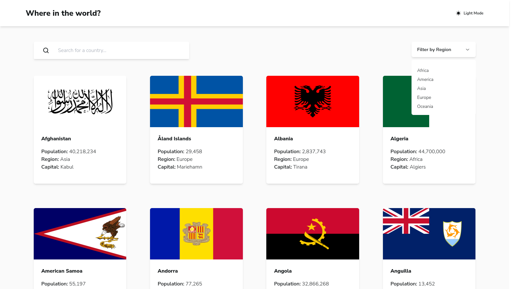
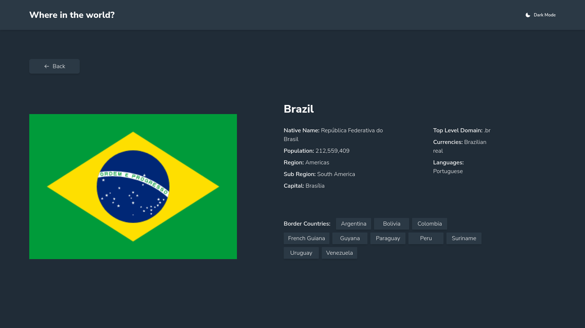
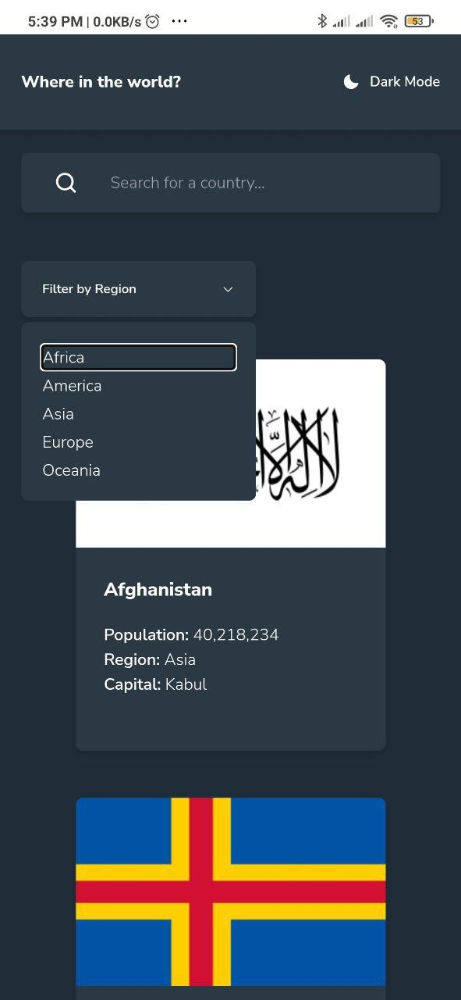

# Frontend Mentor - REST Countries API with color theme switcher solution

This is a solution to the [REST Countries API with color theme switcher challenge on Frontend Mentor](https://www.frontendmentor.io/challenges/rest-countries-api-with-color-theme-switcher-5cacc469fec04111f7b848ca). Frontend Mentor challenges help you improve your coding skills by building realistic projects. 

## Table of contents

- [Overview](#overview)
  - [The challenge](#the-challenge)
  - [Screenshot](#screenshot)
  - [Links](#links)
- [My process](#my-process)
  - [Built with](#built-with)
  - [What I learned](#what-i-learned)
- [Author](#author)
- [Acknowledgments](#acknowledgments)

## Overview

### The challenge

Users should be able to:

- See all countries from the API on the homepage
- Search for a country using an `input` field
- Filter countries by region
- Click on a country to see more detailed information on a separate page
- Click through to the border countries on the detail page
- Toggle the color scheme between light and dark mode *(optional)*

### Screenshot







### Links

- Live Site URL: [Frontend Mentor - Where in the world?](https://frontend-mentor-where-in-the-world.vercel.app/)
- Solution Site URL: [A solution using React, Typescript, TailwindCSS and Axios](https://www.frontendmentor.io/solutions/a-solution-using-react-typescript-tailwindcss-and-axios-dEHgrRY1jL)

## My process

### Built with

- [React](https://reactjs.org/) - JS library
- [TailwindCSS](https://tailwindcss.com/) - for Styles
- [Axios](https://axios-http.com/) - Promise based HTTP client
- [Phosphor Icons](https://phosphoricons.com/) - for app's icons
- [Radix UI](https://www.radix-ui.com/) - for filter primitive component

### What I learned

It was challenging to figure out a strategy to achieve the intersection between the search bar and the filter selection. The strategy used is showed as follows:

```typescript
function countriesFilter(){
    const searchBarCountries = countries.filter(country => {
        return country.countryName.toLowerCase().includes(searchTerm.toLowerCase())
    })
    
    const continentFilterCountries = countries.filter(country => {
        return country.region.toLowerCase().includes(continentFilterTerm.toLowerCase())
    })

    if(continentFilterCountries.length > 0){
        return searchBarCountries.filter(country => continentFilterCountries.indexOf(country) !== -1)
    }
    return searchBarCountries
}
```


## Author

- Frontend Mentor - [@bernard-rodrigues](https://www.frontendmentor.io/profile/bernard-rodrigues)
- LinkedIn - [@bernard-rodrigues](https://www.linkedin.com/in/bernard-rodrigues/)